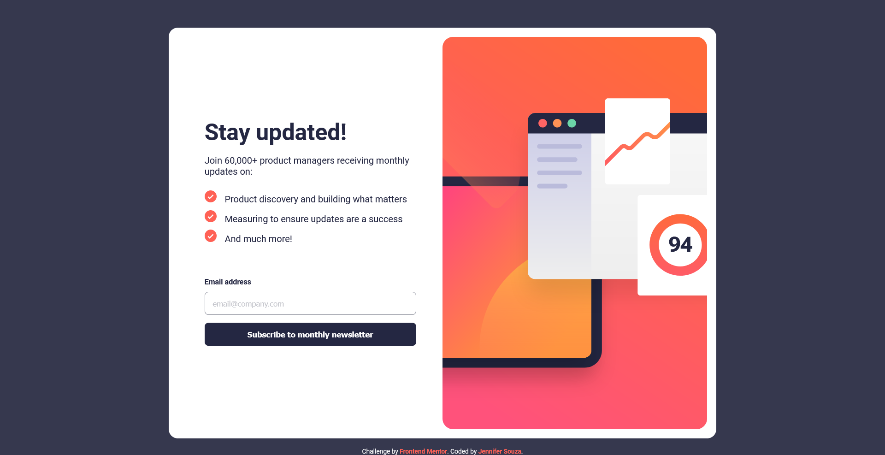

# Frontend Mentor - Newsletter sign-up form with success message solution

This is a solution to the [Newsletter sign-up form with success message challenge on Frontend Mentor](https://www.frontendmentor.io/challenges/newsletter-signup-form-with-success-message-3FC1AZbNrv). Frontend Mentor challenges help you improve your coding skills by building realistic projects. 

## Table of contents

- [Overview](#overview)
  - [The challenge](#the-challenge)
  - [Screenshot](#screenshot)
  - [Links](#links)
- [My process](#my-process)
  - [Built with](#built-with)
  - [What I learned](#what-i-learned)
  - [Continued development](#continued-development)
  - [Useful resources](#useful-resources)
- [Author](#author)

## Overview

### The challenge

Users should be able to:

- Add their email and submit the form
- See a success message with their email after successfully submitting the form
- See form validation messages if:
  - The field is left empty
  - The email address is not formatted correctly
- View the optimal layout for the interface depending on their device's screen size
- See hover and focus states for all interactive elements on the page

### Screenshot

### Links

- Solution URL: [https://github.com/zoedarkweather/newsletter-signup-form](https://github.com/zoedarkweather/newsletter-signup-form)
- Live Site URL: [https://newsletter-signup-form-eta.vercel.app/](https://newsletter-signup-form-eta.vercel.app/)

## My process

### Built with

- Semantic HTML5 markup
- CSS custom properties
- CSS Grid
- Mobile-first workflow
- JavaScript

### What I learned

I learned how to hide elements from screenreaders - I realize that often you may not want to do that, but instead want to visually hide something while showing it to screenreaders - but in this case it was important that it not be read as it would be confusing. I don't know if my solution of moving the things on and off screen is the best way to go about it, but to me it seemed like the simplest solution. I'm curious to see how other people approached this or if there is any kind of best practice for something like this that I should be aware of.  

10/12 updates: After learning about the dialog element, I updated this project to use it for the success message. This seems like a much cleaner and simpler solution and shortened my JavaScript code considerably.

### Continued development

Continue practicing CSS and Javascript. 

### Useful resources

- [https://developer.mozilla.org/en-US/docs/Web/HTML/Element/dialog](https://developer.mozilla.org/en-US/docs/Web/HTML/Element/dialog) - This taught me how to use the dialog element.

- [https://www.pluralsight.com/guides/how-to-hide-text-from-screen-readers](https://www.pluralsight.com/guides/how-to-hide-text-from-screen-readers) - This helped me decide how best to hide my hidden elements from screenreaders. I chose to set visibility hidden rather than an Aria label, so that I could just toggle a hidden class to show/hide the elements.

## Author

- Github - [Jennifer Souza](https://github.com/zoedarkweather)
- Frontend Mentor - [@zoedarkweather](https://www.frontendmentor.io/profile/zoedarkweather)
